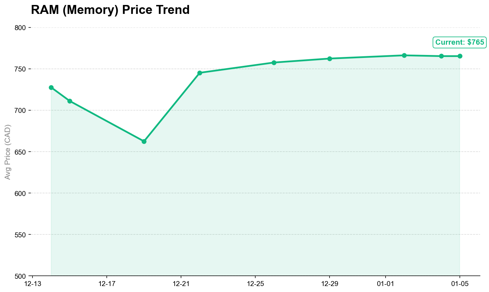

# 🖥️ Canada PC Parts Price Tracker & Insights

캐나다 주요 리테일러의 컴퓨터 부품 가격 데이터를 수집하고 분석하는 프로젝트입니다.

## 💡 Project Goal
* 캐나다 컴퓨터 부품 시장의 가격 변동 추이 파악.
* GPU 등 주요 부품의 적정 매수 타이밍 예측.
* 데이터 시각화를 통한 시장 Insight 도출.

## 🛠 Planned Tech Stack
* **Data Collection:** Python (BeautifulSoup, Selenium)
* **Storage:** PostgreSQL / Google BigQuery
* **Analysis:** Pandas, Scikit-learn
* **Visualization:** Plotly (Interative Charts)

## 📊 RAM Price Trend
