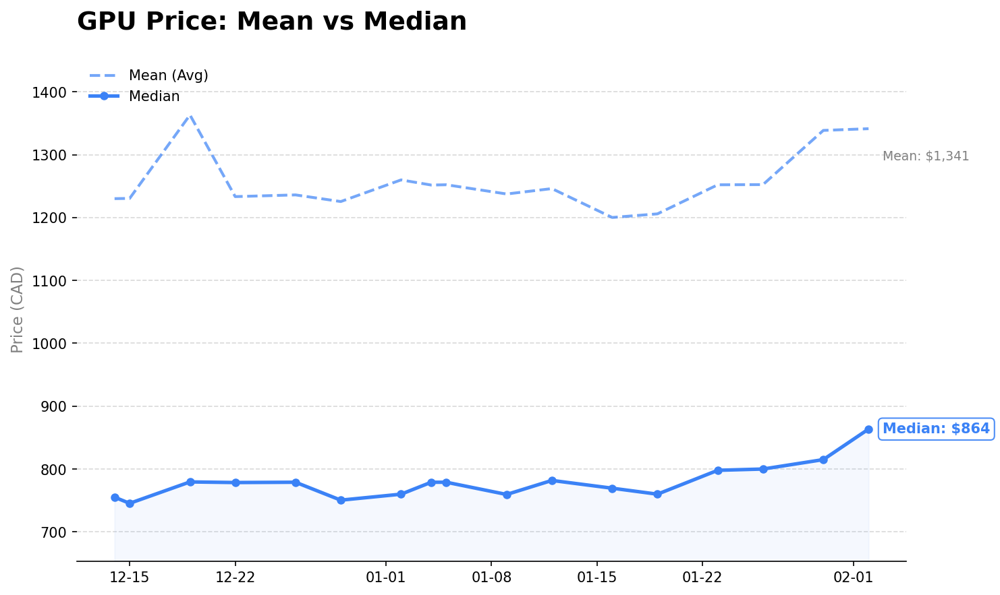

# 🖥️ Canada PC Parts Price Tracker & Insights

This project collects and analyzes computer part price data from major Canadian retailers.

## 💡 Project Goal
* **Why:** To identify price fluctuation trends in the Canadian computer parts market.
* **How:** By tracking historical data to predict the optimal purchase timing for key components like GPUs.
* **Result:** Deriving market insights through data visualization.

## 🛠 Planned Tech Stack
* **Data Collection:** Python (BeautifulSoup, Selenium)
* **Storage:** PostgreSQL / Google BigQuery
* **Analysis:** Pandas, Scikit-learn
* **Visualization:** Plotly (Interactive Charts)

## 📊 Price Trend Charts

