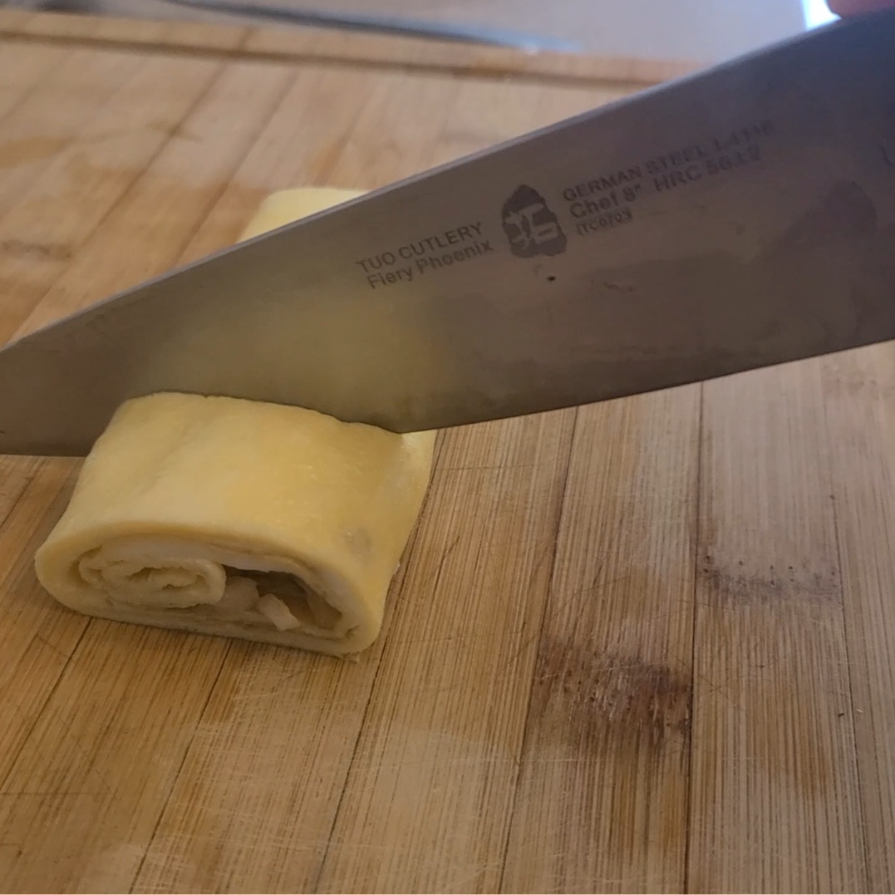
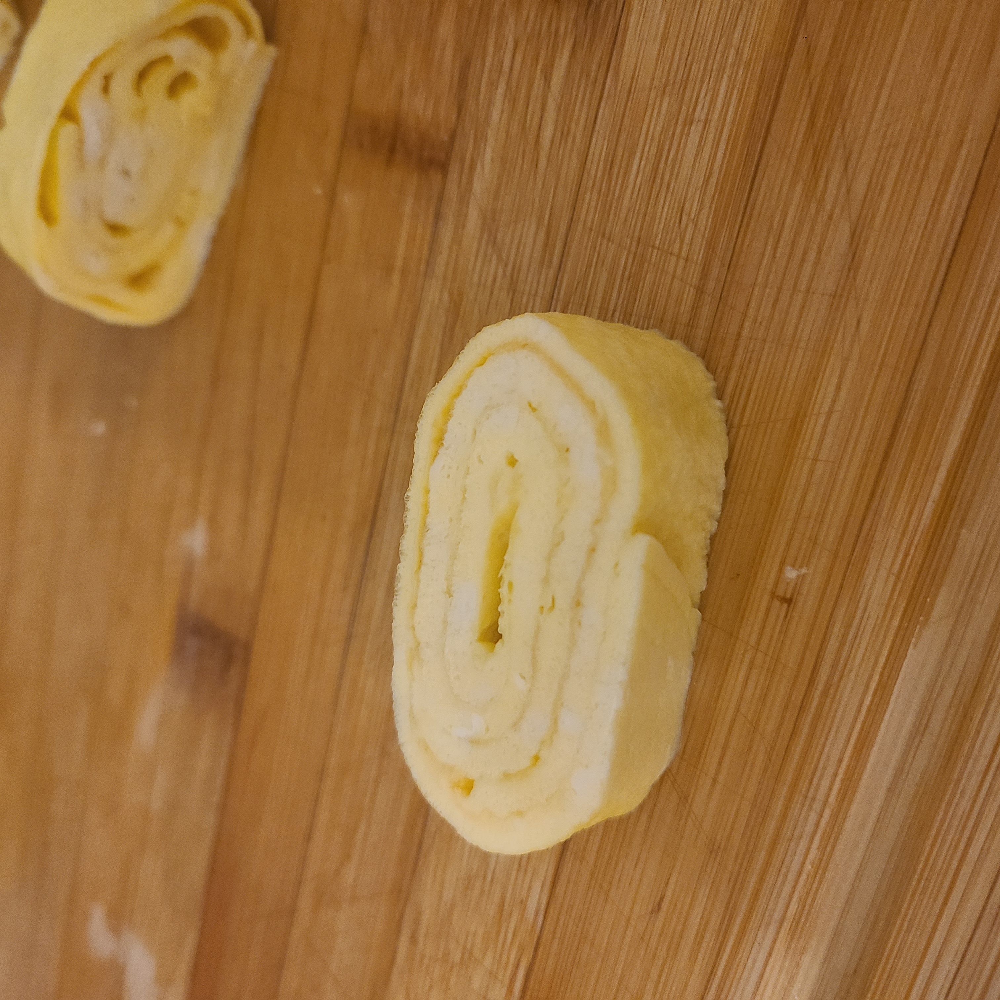
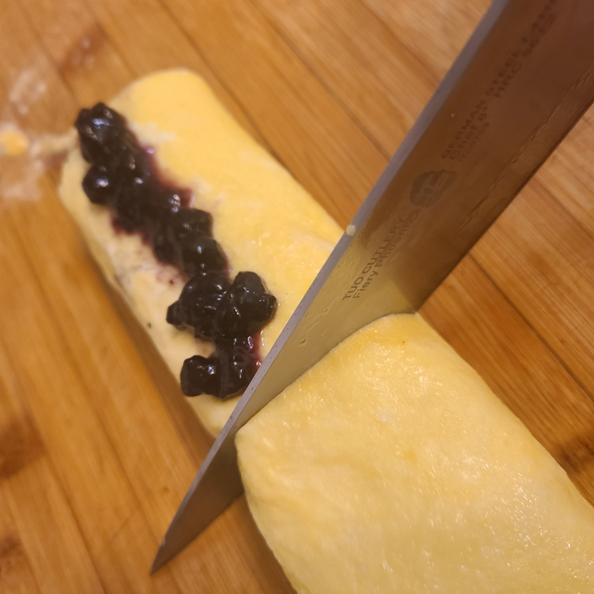
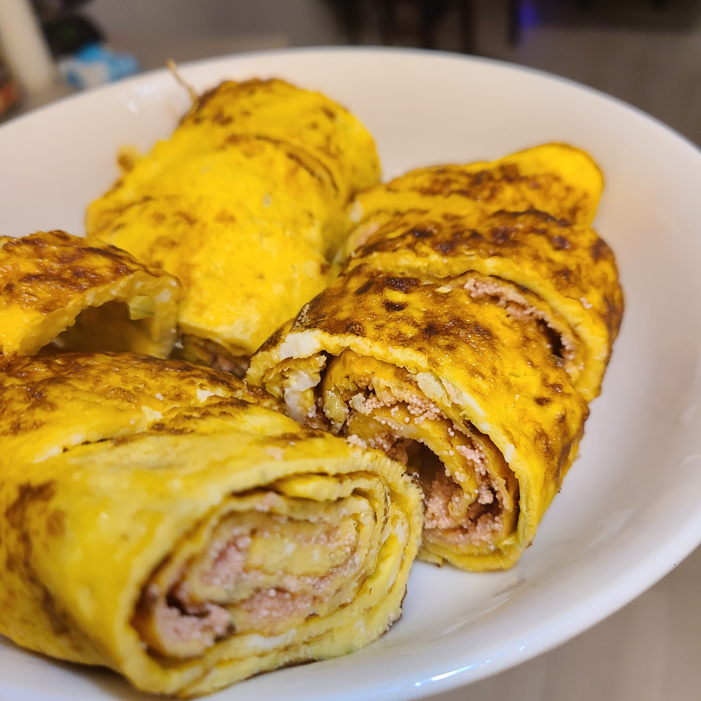
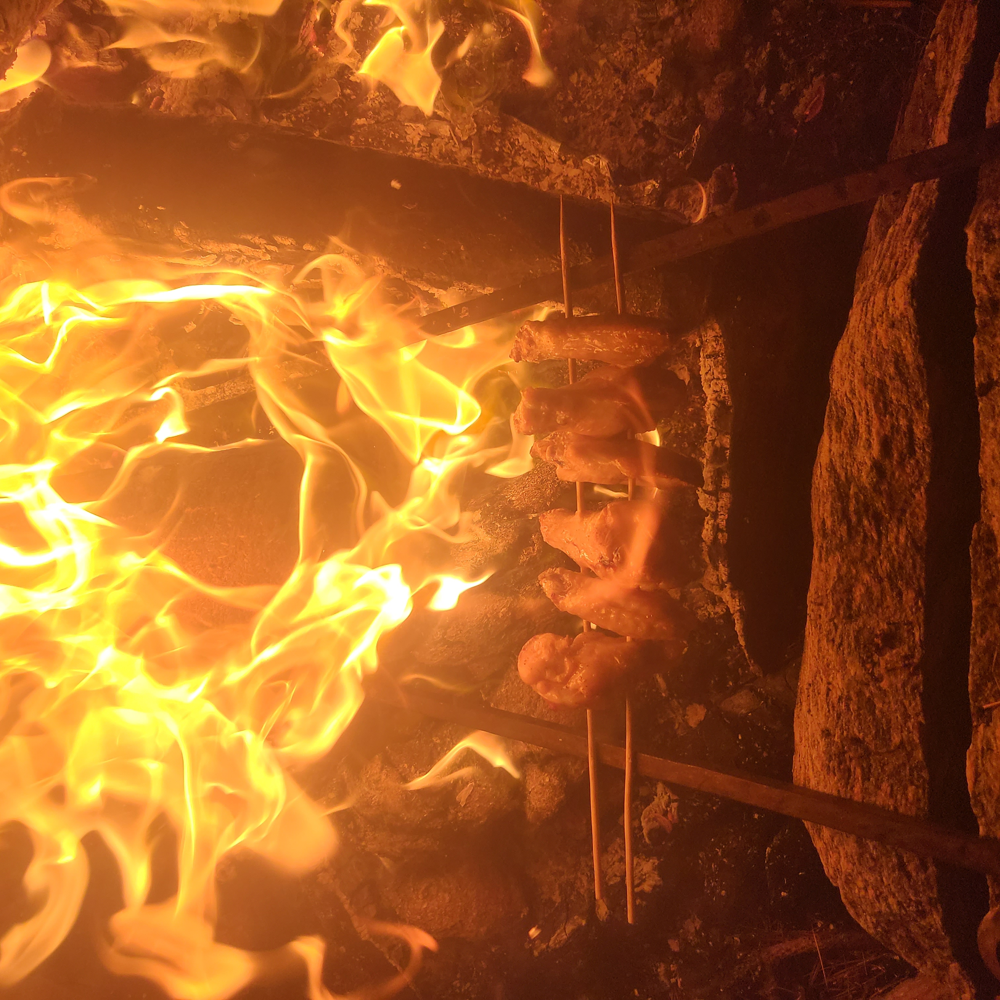

# Algorithm of Taste - Cooking Log

데이터 기반으로 자동 생성된 요리 기록입니다.

---

### 📅 2026-01-25 : Lettuce Soy Gue-Ran Ma-Ri

> 📝 **Note**: Tried Putting Lettuce

**Tags**: `#Lettuce` `#Soy`

 

---

### 📅 2026-01-19 : Tofu & Blueberry Spread Gue-Ran Ma-Ri

> 📝 **Note**: Without jam

**Tags**: `#Tofu` `#Gue-Ran Ma-Ri`

 

---

### 📅 2026-01-19 : Tofu & Blueberry Spread Gue-Ran Ma-Ri

**Tags**: `#Tofu` `#Blueberry Spread` `#Gue-Ran Ma-Ri`

 

---

### 📅 2026-01-19 : Tofu & Blueberry Spread Gue-Ran Ma-Ri

**Tags**: `#Tofu` `#Blueberry Spread` `#Gue-Ran Ma-Ri`

 

---

### 📅 2026-01-17 : Tomato Sauce Filled Gue-Ran Ma-Ri

> 📝 **Note**: Found a way to consume remaining tomato sauce!

**Tags**: `#Tomato Sauce` `#Gue-Ran Ma-Ri`

 

---

### 📅 2026-01-15 : Shrimp Gue-Ran Ma-Ri

> 📝 **Note**: Mashed shrimp Gue-Ran Ma-Ri

**Tags**: `#Shrimp` `#Gue-Ran Ma-Ri`

 

---

### 📅 2026-01-12 : Cod Roe Gue-Ran Ma-Ri

> 📝 **Note**: Started to try various types of Gue-Ran Ma-Ri

**Tags**: `#Cod Roe` `#Mayo` `#Gue-Ran Ma-Ri`

 

---

### 📅 2026-01-11 : Getting interested in Gue-Ran Ma-Ri

> 📝 **Note**: Leek Added

**Tags**: `#Leek` `#Honey` `#Gue-Ran Ma-Ri`

 

---

### 📅 2025-12-29 : First Ever Gue-Ran Ma-Ri

> 📝 **Note**: First attempt of making Gue-Ran Ma-Ri

**Tags**: `#Korean Egg Rolls` `#Gue-Ran Ma-Ri`

 

---

### 📅 2025-12-25 : Campfire chicken wings

> 📝 **Note**: BBQ Wings

**Tags**: `#BBQ` `#Wings` `#Campfire`

 

---

